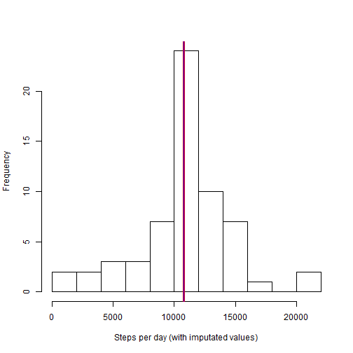

Activity Monitoring
===================

Activity Monitoring allows to collect data on the quantity of steps an individual makes. The sample of this study has been collected at five minute intervals throughout the months of October and November 2012.

### Loading and preprocessing data

The following code loads the raw data file into the variable raw_data, provided the file has been stored in the current working directory.


```r
data<-read.csv("activity.csv", header=TRUE)
```

For a first impression of the data on hand, it is useful to check the structure of the new data frame and the first and last couple of lines:


```r
str(data)
```

```
## 'data.frame':	17568 obs. of  3 variables:
##  $ steps   : int  NA NA NA NA NA NA NA NA NA NA ...
##  $ date    : Factor w/ 61 levels "2012-10-01","2012-10-02",..: 1 1 1 1 1 1 1 1 1 1 ...
##  $ interval: int  0 5 10 15 20 25 30 35 40 45 ...
```

```r
head(data)
```

```
##   steps       date interval
## 1    NA 2012-10-01        0
## 2    NA 2012-10-01        5
## 3    NA 2012-10-01       10
## 4    NA 2012-10-01       15
## 5    NA 2012-10-01       20
## 6    NA 2012-10-01       25
```

```r
tail(data)
```

```
##       steps       date interval
## 17563    NA 2012-11-30     2330
## 17564    NA 2012-11-30     2335
## 17565    NA 2012-11-30     2340
## 17566    NA 2012-11-30     2345
## 17567    NA 2012-11-30     2350
## 17568    NA 2012-11-30     2355
```

The str function shows that the date is formatted as factor, and the interval is not in a time format, but mimicking a time format. This doesn't seem useful for most analysis and needs to be adressed. The interval can be split up in hours and minutes with integer division by 100 ( %/% ) and modulo operation ( %% ). As date and time formats in R used seconds since a starting date as storage format, the time can be integrated in the date by adding minutes times 60 and hours times 60 times 60 (giving time in seconds).
As keeping the date as a factor is helpful for all per day analysis, a new variable for the date is created.


```r
data$intsec<-((data$interval %/% 100)*60*60 + (data$interval %% 100)*60)
data$dat<-strptime(as.character(data$date), "%Y-%m-%d") ## Formatting date in a date format
data$dat<-data$dat + data$intsec
data$time<-strftime(data$dat, format="%H:%M")
data$datum<-strptime(data$dat, format="%Y-%m-%d")
head(data)
```

```
##   steps       date interval intsec                 dat  time      datum
## 1    NA 2012-10-01        0      0 2012-10-01 00:00:00 00:00 2012-10-01
## 2    NA 2012-10-01        5    300 2012-10-01 00:05:00 00:05 2012-10-01
## 3    NA 2012-10-01       10    600 2012-10-01 00:10:00 00:10 2012-10-01
## 4    NA 2012-10-01       15    900 2012-10-01 00:15:00 00:15 2012-10-01
## 5    NA 2012-10-01       20   1200 2012-10-01 00:20:00 00:20 2012-10-01
## 6    NA 2012-10-01       25   1500 2012-10-01 00:25:00 00:25 2012-10-01
```

```r
tail(data)
```

```
##       steps       date interval intsec                 dat  time
## 17563    NA 2012-11-30     2330  84600 2012-11-30 23:30:00 23:30
## 17564    NA 2012-11-30     2335  84900 2012-11-30 23:35:00 23:35
## 17565    NA 2012-11-30     2340  85200 2012-11-30 23:40:00 23:40
## 17566    NA 2012-11-30     2345  85500 2012-11-30 23:45:00 23:45
## 17567    NA 2012-11-30     2350  85800 2012-11-30 23:50:00 23:50
## 17568    NA 2012-11-30     2355  86100 2012-11-30 23:55:00 23:55
##            datum
## 17563 2012-11-30
## 17564 2012-11-30
## 17565 2012-11-30
## 17566 2012-11-30
## 17567 2012-11-30
## 17568 2012-11-30
```

It is quite clear from the data that there are many NA values in the steps variable, but there might be NAs in the other variables as well.


```r
any(is.na(data$steps))
```

```
## [1] TRUE
```

```r
any(is.na(data$date))
```

```
## [1] FALSE
```

```r
any(is.na(data$interval))
```

```
## [1] FALSE
```

So there are only missing values in the steps variable which will be handled later in the analysis.


### What is mean total number of steps taken per day?

For answering questions about the activity per day, the sum of steps per day (over all intervals) needs to be calculated and stored.


```r
sspd<-split(data, data$date) ## Split the dataframe according to the date
spd<-sapply(sspd, function (x) sum(x["steps"], na.rm=TRUE)) ## Calculate the sum of steps per day
rm(sspd)
perday<-data.frame(date=unique(data$datum), steps=spd) ## Create data.frame for summary data per day
row.names(perday)<-NULL
```

The dataframe perday now contains information on the steps taken per day:


```r
perday
```

```
##          date steps
## 1  2012-10-01     0
## 2  2012-10-02   126
## 3  2012-10-03 11352
## 4  2012-10-04 12116
## 5  2012-10-05 13294
## 6  2012-10-06 15420
## 7  2012-10-07 11015
## 8  2012-10-08     0
## 9  2012-10-09 12811
## 10 2012-10-10  9900
## 11 2012-10-11 10304
## 12 2012-10-12 17382
## 13 2012-10-13 12426
## 14 2012-10-14 15098
## 15 2012-10-15 10139
## 16 2012-10-16 15084
## 17 2012-10-17 13452
## 18 2012-10-18 10056
## 19 2012-10-19 11829
## 20 2012-10-20 10395
## 21 2012-10-21  8821
## 22 2012-10-22 13460
## 23 2012-10-23  8918
## 24 2012-10-24  8355
## 25 2012-10-25  2492
## 26 2012-10-26  6778
## 27 2012-10-27 10119
## 28 2012-10-28 11458
## 29 2012-10-29  5018
## 30 2012-10-30  9819
## 31 2012-10-31 15414
## 32 2012-11-01     0
## 33 2012-11-02 10600
## 34 2012-11-03 10571
## 35 2012-11-04     0
## 36 2012-11-05 10439
## 37 2012-11-06  8334
## 38 2012-11-07 12883
## 39 2012-11-08  3219
## 40 2012-11-09     0
## 41 2012-11-10     0
## 42 2012-11-11 12608
## 43 2012-11-12 10765
## 44 2012-11-13  7336
## 45 2012-11-14     0
## 46 2012-11-15    41
## 47 2012-11-16  5441
## 48 2012-11-17 14339
## 49 2012-11-18 15110
## 50 2012-11-19  8841
## 51 2012-11-20  4472
## 52 2012-11-21 12787
## 53 2012-11-22 20427
## 54 2012-11-23 21194
## 55 2012-11-24 14478
## 56 2012-11-25 11834
## 57 2012-11-26 11162
## 58 2012-11-27 13646
## 59 2012-11-28 10183
## 60 2012-11-29  7047
## 61 2012-11-30     0
```

Note that missing values have not yet been imputated. The number of steps shown here are therefore only a lower limit for the steps taken.
 

```r
m1<-round(mean(perday$steps), 1)
m2<-as.integer(median(perday$steps))
## These calculations are used to report the mean and median of the steps taken in the text below and for creating the histogram.
```

The mean of the steps taken per day is 9354.2, the median of the steps taken per day 10395.
The following histogram shows the distribution of steps per day (mean indicated with a red line, median with a blue line):


```r
hist(perday$steps, breaks=9, main="", xlab="Steps per day")
abline(v=m1, col="red")
abline(v=m2, col="blue")
```

 


### What is the average daily activity pattern?

Regarding the average daily activity pattern, averages of the steps per interval over all days need to be computed and stored.


```r
sspi<-split(data, data$interval) ## Split the dataframe according to the interval
spi<-sapply(sspi, function(x) colMeans(x["steps"], na.rm=TRUE)) ## Calculate the mean of steps per interval
rm(sspi)
perint<-data.frame(interval=unique(data$time), avsteps=spi) ## Create data.frame for summary data per interval
row.names(perint)<-NULL
```

The following plot shows the resulting data:


```r
plot(strptime(perint$interval, format="%H:%M"), perint$avsteps, type="l", lty=1, xlab="Interval", ylab="Mean steps")
```

 

The interval with the maximum of average steps can easily be calculated from the data:


```r
maxi<-0
ind<-0
for(i in 1:length(perint$interval)) {
        if (perint[i,2]>maxi) {
                maxi<-perint[i,2]
                ind<-i
        }
}
maximum<-round(maxi,1) ## Maximum of average steps rounded to one decimal digit
inter<-perint[ind,1] ## and according interval calculated for use in the following text
```

The maximum of average steps during one interval is 206.2 which is reached at 08:35.


### Imputing missing values

As seen above, there are only missing values in the steps column of the original data.


```r
nas<-is.na(data$steps)
nona<-sum(nas) ## Calculation sum of NAs using the fact that TRUEs are coerced to "1" and FALSES to "0" when calculating numerical.
lendata<-length(nas)
percent<-round(nona/lendata*100, 1)
```

There are 2304 missing values in the steps column from the 17568 values total (which is 13.1% NAs). As an approach for imputating those values, the average of steps for the specific interval shall be taken. The data with imputated values is stored in a new data.frame.


```r
## Creating new dataframe
dataimp<-data
## Imputating values
for(i in 1:length(data$steps)) {
        if (is.na(dataimp[i,1])) {
                introw<-(data[i,4] %/% 300)+1
                dataimp[i,1]<-perint[introw,2]
        }
}
head(dataimp)
```

```
##       steps       date interval intsec                 dat  time
## 1 1.7169811 2012-10-01        0      0 2012-10-01 00:00:00 00:00
## 2 0.3396226 2012-10-01        5    300 2012-10-01 00:05:00 00:05
## 3 0.1320755 2012-10-01       10    600 2012-10-01 00:10:00 00:10
## 4 0.1509434 2012-10-01       15    900 2012-10-01 00:15:00 00:15
## 5 0.0754717 2012-10-01       20   1200 2012-10-01 00:20:00 00:20
## 6 2.0943396 2012-10-01       25   1500 2012-10-01 00:25:00 00:25
##        datum
## 1 2012-10-01
## 2 2012-10-01
## 3 2012-10-01
## 4 2012-10-01
## 5 2012-10-01
## 6 2012-10-01
```

```r
tail(dataimp)
```

```
##           steps       date interval intsec                 dat  time
## 17563 2.6037736 2012-11-30     2330  84600 2012-11-30 23:30:00 23:30
## 17564 4.6981132 2012-11-30     2335  84900 2012-11-30 23:35:00 23:35
## 17565 3.3018868 2012-11-30     2340  85200 2012-11-30 23:40:00 23:40
## 17566 0.6415094 2012-11-30     2345  85500 2012-11-30 23:45:00 23:45
## 17567 0.2264151 2012-11-30     2350  85800 2012-11-30 23:50:00 23:50
## 17568 1.0754717 2012-11-30     2355  86100 2012-11-30 23:55:00 23:55
##            datum
## 17563 2012-11-30
## 17564 2012-11-30
## 17565 2012-11-30
## 17566 2012-11-30
## 17567 2012-11-30
## 17568 2012-11-30
```

Now, steps per day as well as their mean and median are calculated again, using imputated data.


```r
sspdimp<-split(dataimp, dataimp$date) ## Split the dataframe according to the date
spdimp<-sapply(sspdimp, function (x) sum(x["steps"], na.rm=TRUE)) ## Calculate the sum of steps per day
rm(sspdimp)
perdayimp<-data.frame(date=unique(dataimp$datum), steps=spdimp) ## Create data.frame for summary data per day
row.names(perdayimp)<-NULL
```

The dataframe perday now contains information on the steps taken per day:


```r
perdayimp
```

```
##          date    steps
## 1  2012-10-01 10766.19
## 2  2012-10-02   126.00
## 3  2012-10-03 11352.00
## 4  2012-10-04 12116.00
## 5  2012-10-05 13294.00
## 6  2012-10-06 15420.00
## 7  2012-10-07 11015.00
## 8  2012-10-08 10766.19
## 9  2012-10-09 12811.00
## 10 2012-10-10  9900.00
## 11 2012-10-11 10304.00
## 12 2012-10-12 17382.00
## 13 2012-10-13 12426.00
## 14 2012-10-14 15098.00
## 15 2012-10-15 10139.00
## 16 2012-10-16 15084.00
## 17 2012-10-17 13452.00
## 18 2012-10-18 10056.00
## 19 2012-10-19 11829.00
## 20 2012-10-20 10395.00
## 21 2012-10-21  8821.00
## 22 2012-10-22 13460.00
## 23 2012-10-23  8918.00
## 24 2012-10-24  8355.00
## 25 2012-10-25  2492.00
## 26 2012-10-26  6778.00
## 27 2012-10-27 10119.00
## 28 2012-10-28 11458.00
## 29 2012-10-29  5018.00
## 30 2012-10-30  9819.00
## 31 2012-10-31 15414.00
## 32 2012-11-01 10766.19
## 33 2012-11-02 10600.00
## 34 2012-11-03 10571.00
## 35 2012-11-04 10766.19
## 36 2012-11-05 10439.00
## 37 2012-11-06  8334.00
## 38 2012-11-07 12883.00
## 39 2012-11-08  3219.00
## 40 2012-11-09 10766.19
## 41 2012-11-10 10766.19
## 42 2012-11-11 12608.00
## 43 2012-11-12 10765.00
## 44 2012-11-13  7336.00
## 45 2012-11-14 10766.19
## 46 2012-11-15    41.00
## 47 2012-11-16  5441.00
## 48 2012-11-17 14339.00
## 49 2012-11-18 15110.00
## 50 2012-11-19  8841.00
## 51 2012-11-20  4472.00
## 52 2012-11-21 12787.00
## 53 2012-11-22 20427.00
## 54 2012-11-23 21194.00
## 55 2012-11-24 14478.00
## 56 2012-11-25 11834.00
## 57 2012-11-26 11162.00
## 58 2012-11-27 13646.00
## 59 2012-11-28 10183.00
## 60 2012-11-29  7047.00
## 61 2012-11-30 10766.19
```


```r
m1imp<-as.integer(round(mean(perdayimp$steps), 0))
m2imp<-as.integer(median(perdayimp$steps))
## These calculations are used to report the mean and median of the steps taken in the text below and for creating the histogram.
```

The mean of the steps taken per day is 10766, the median of the steps taken per day 10766.
The following histogram shows the distribution of steps per day (mean indicated with a red line, median with a blue line):


```r
hist(perdayimp$steps, breaks=9, main="", xlab="Steps per day (with imputated values)")
abline(v=m1imp, col="red", lwd=3)
abline(v=m2imp, col="blue")
```

 

As a comparison, the original histogram again:


```r
hist(perday$steps, breaks=9, main="", xlab="Steps per day (without imputated values)")
abline(v=m1, col="red")
abline(v=m2, col="blue")
```

 

The pattern of the data seems quite similar, except for the days with 0 or very few steps, which has been reduced quite a lot after imputation. In general, the number of steps after imputation is higher, but that isn't a surprise as the data without imputated values could be used as an estimate for the lower limit of steps.


### Are there differences in activity patterns between weekdays and weekends?

First, a new factor variable has to be created that indicates whether a row of data belongs to a weekday or weekend. The average number of steps per interval has to be calculated for weekdays and weekends.


```r
## Doing this assignment outside US - changing settings for getting English weekday names.
Sys.setlocale("LC_TIME", "English")
```

```
## [1] "English_United States.1252"
```

```r
## Adding factor variable for weekdays/weekends
dataimp$wd<-weekdays(dataimp$dat)
dataimp$wed<-"weekday"
for(i in 1:length(dataimp$wed)) {
        if (dataimp[i,8]=="Saturday"|dataimp[i,8]=="Sunday") {dataimp[i,9]<-"weekend"}
}
dataimp$wed<-as.factor(dataimp$wed)

## Calculating average number of steps per interval, seperate for weeksdays and weekends
sspiw<-split(dataimp, list(dataimp$interval, dataimp$wed))
spiw<-sapply(sspiw, function(x) colMeans(x["steps"], na.rm=TRUE)) ## Calculate the mean of steps per interval and wd/we
rm(sspiw)
## Create data.frame for summary data per interval
perintw<-data.frame(interval=unique(dataimp$time), format="%H:%M")
perintw<-rbind(perintw, perintw)
perintw$wed<-as.factor(c(rep("Weekday",288), rep("Weekend",288)))
perintw$avsteps<-spiw
str(perintw)
```

```
## 'data.frame':	576 obs. of  4 variables:
##  $ interval: Factor w/ 288 levels "00:00","00:05",..: 1 2 3 4 5 6 7 8 9 10 ...
##  $ format  : Factor w/ 1 level "%H:%M": 1 1 1 1 1 1 1 1 1 1 ...
##  $ wed     : Factor w/ 2 levels "Weekday","Weekend": 1 1 1 1 1 1 1 1 1 1 ...
##  $ avsteps : num  2.251 0.445 0.173 0.198 0.099 ...
```

```r
row.names(perintw)<-NULL
```

Afterwards, a time series panel plot can be created:


```r
## install.packages("lattice") ## Only has to be done if lattice has not yet been installed.
library(lattice)
```

```
## Warning: package 'lattice' was built under R version 3.1.3
```

```r
xyplot(avsteps ~ interval | wed, perintw, layout=c(1,2), type="l", xlab="Interval", ylab="Number of steps")
```

 

A first inspection of the data shows that there are quite some differences in the time patterns of activities between weekdays and weekends.
